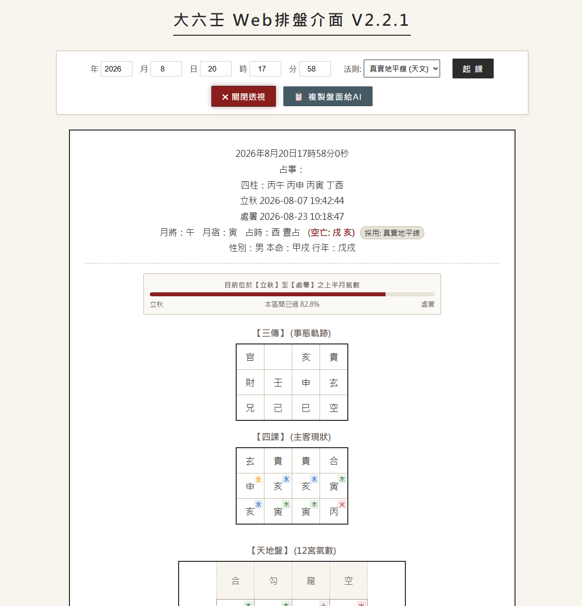

# 大六壬Web排盤介面 (Da Liu Ren Web Engine)



這是一個將傳統大六壬 Python 引擎現代化、Web 化的開源專案。
本專案基於 FastAPI 建構後端 API，並搭配高度視覺化的無框架前端介面，專為現代大六壬實戰預測與 AI 輔助分析所設計。

## 核心功能與優化

* **氣數透視**
  * 前端內建動態 DOM 解析器。開啟透視模式後，系統會自動剔除四課中的「生/比」無效資訊，專注標示引發事件矛盾的「下賊上/上剋下」箭頭，並將落入「空亡」的地支陷阱視覺化，大幅提升實戰抓取發用的直覺。
* **晝夜雙軌演算法**
  * 跳脫傳統寫死的系統時間，引入雙軌晝夜判定機制。使用者可依據實戰心法，於前端介面自由切換「傳統卯酉分界」或基於正弦波逼近演算法的「真實天文地平線 (日出日落)」來決定晝夜貴人。
* **結構化數據萃取**
  * 內建純淨數據萃取引擎，可一鍵將繁雜的 HTML 盤面 (包含隱藏的空亡與賊剋參數) 轉換為乾淨的 Markdown 結構化文本，無縫對接 ChatGPT、Claude 等大語言模型進行輔助解盤。
* **回歸正統貴人訣 (底層修正)**
  * 修正了原開源引擎中關於「甲日晝占」貴人落在未(羊)的流派爭議。本專案已將底層陣列修正為《御定六壬直指》等主流經典所採用的「甲戊庚牛羊」標準法則 (甲日晝占為丑)。


## 演算法與流派考證 (For Experts)

為了讓大六壬研究者與開發者能安心將本專案用於實戰與學術回測，本引擎之底層起課邏輯皆經過嚴格校對。以下為本專案核心演算法的流派依據與參數設定：

| 核心排盤要素  | 本專案採用之邏輯 / 演算法                                    | 流派依據與考證說明                                           |
| :------------ | :----------------------------------------------------------- | :----------------------------------------------------------- |
| 晝夜貴人判定  | 雙軌制 (前端可動態切換)：<br>1. 傳統卯酉分界<br>2. 真實天文地平線 (正弦波逼近演算法) | 兼顧宋代後約定俗成的「卯酉捷法」，以及《吳越春秋》古課中嚴格遵循的「星出星沒 (真實天象)」實證派古法。 |
| 十干貴人訣    | 甲戊庚牛羊<br>(甲日：晝占丑、夜占未)                         | 原開源庫[daliurenpython](https://github.com/wlhyl/dalurenpython)採用了小眾的「陰陽旦暮派」(甲日晝占為未)，本專案已將底層 `shipan.py` 陣列修正，全面回歸《御定六壬直指》等主流經典派法則。 |
| 節氣與月將    | 精確天文計算，過「中氣」換將                                 | 內建 ELP2000-82 / IAU1980 曆法模型計算太陽黃經。嚴格以太陽實際過宮 (中氣交接) 到分秒為基準來切換月將，非粗略按日子切換。 |
| 四課排法      | 常規標準四課<br>(一課干、二課干陰、三課支、四課支陰)         | 遵循《大六壬大全》標準天地盤寄宮與上神提取邏輯。             |
| 九宗門 (三傳) | 完整實作九宗法<br>(賊剋、比用、涉害、遙剋、昴星、別責、八專、伏吟、返吟) | 嚴格依循傳統九宗法遞進邏輯。涉害法遵循「歷歸本家」之深度計算，並完善孟、仲發用之「見機」、「察微」等判定。 |

### 重大底層 Bug 修正 (曆法與月將)

除了修正貴人訣的流派爭議外，本專案針對原開源庫[daliurenpython](https://github.com/wlhyl/dalurenpython)的曆法引擎進行了關鍵修復：
* 跨年節氣錯置修正：修正了 `GetLi` 函數在「小寒」到「大寒」節氣區間內，會錯誤將年度 +1 的邏輯問題。此修復徹底解決了在年初時段起課，會導致「月將錯置」與「節氣判定越界」的嚴重計算偏差，確保了排盤的絕對精準度。

## 專案結構

```text
daliuren-web-engine/
│
├── app/                  # FastAPI 後端引擎
│   ├── main.py           # API 路由入口
│   ├── services/         # 業務邏輯與 API 封裝
│   └── repo_core/        # 大六壬排盤核心演算法 (已修正貴人訣)
│
├── index.html            # 觀測站前端介面 (SPA)
├── requirements.txt      # 專案依賴套件清單
└── README.md             # 專案說明文檔

```

## 快速啟動指南

### 1. 環境準備

請確保你的系統已安裝 Python 3.8 或以上版本。建議使用虛擬環境進行安裝：

```bash
python -m venv env
source env/bin/activate  # Windows 請使用 env\Scripts\activate

```

### 2. 安裝依賴套件

```bash
pip install -r requirements.txt

```

### 3. 啟動後端引擎

在專案根目錄下執行以下指令啟動 FastAPI 伺服器：

```bash
uvicorn app.main:app --reload

```

看到 `Application startup complete.` 提示後，代表後端引擎已在 `http://127.0.0.1:8000` 成功運行。

### 4. 開啟前端介面

本專案前端採用純粹的 HTML/JS/CSS 撰寫，無需額外編譯。請直接使用瀏覽器 (推薦 Chrome 或 Edge) 開啟專案根目錄下的 `index.html` 檔案，即可開始起課。

## 致謝

本專案的大六壬排盤核心演算法基於[daliurenpython-zh-tw](https://github.com/d1210182010/daliurenpython-zh-tw)，修改自開源專案 [daliurenpython](https://github.com/wlhyl/dalurenpython)。特此致謝原作者在底層曆法與九宗法上的基礎貢獻。

